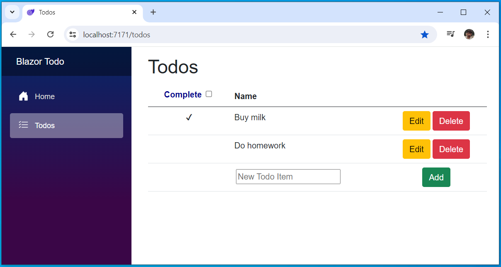

# Simple todo list app without security

This sample demonstrates a simple Blazor WebAssembly application that implements a todo list app without user management.
All endpoints are publicly accessible and no login is required.

## Set up the backend API

Go to https://portal.restapi.com and create a new empty API. Then go to Data -> Collections & Views and select the source tab. Paste in the contents of the schema.json file located in the RestAPISchema folder in the src directory and click Save. You should now have the structure needed to run the app.

## Change appsettings.json

In the appsettings.json in the wwwroot folder, change the BackendUrl to be your API address - found in the Overview section in the portal for your API.

```js
{
  "BackendUrl": "<Your API address found in the Overview section in the portal.>"
}
```

- Replace `"BackendUrl": "<Your API address found in the Overview section in the portal.>",` to (for example) `"BackendUrl": "https://eu.restapi.com/mysampleapi",`

## Run the sample

- Open a terminal and navigate to the sample directory
- Run `dotnet run`

<br />The solution will be available at https://localhost:7171



